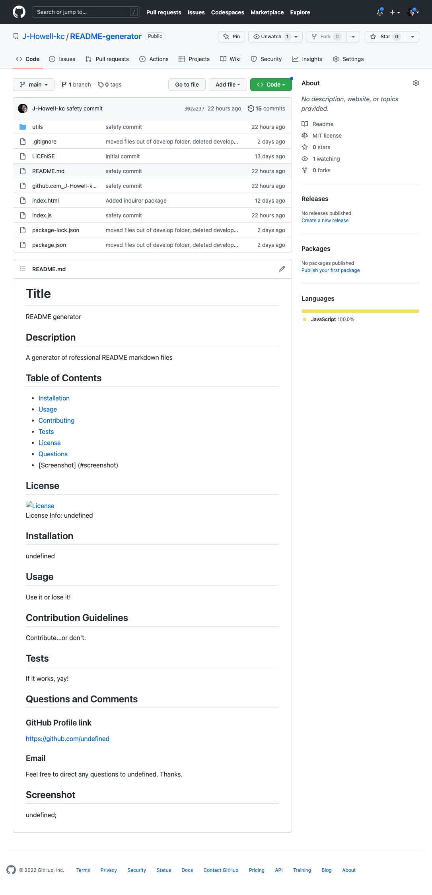

  # Title
readme

## Description
readme

## Table of Contents
* [Installation](#installation)
* [Usage](#usage)
* [Contributing](#contributing)
* [Tests](#tests)
* [License](#license)
* [Questions](#questions)
* [Screenshot](#screenshot)

## License
  
License Info: https://opensource.org/licenses/alphabetical 

## Installation
run it

## Usage
use it

## Contributing
do

## Tests
test it

## Questions 
### GitHub Profile link
https://github.com/j-howell-kc  
### Email
Feel free to direct any questions to howell_j@hotmail.com. Thanks.

## Screenshot
;